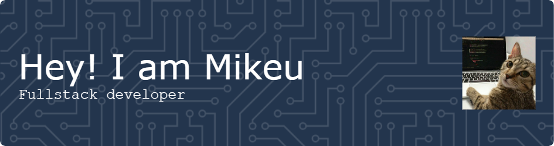

<h1 align="center">Hi there 👋, I'm Riki Ruswandi (Mikeu)</h1>
<h3 align="center">A Passionate Developer from Indonesia</h3>

---

- 🌱 Currently exploring **Reverse Engineering**
- 📫 Reach me at **rikiruswandi28@gmail.com**
- 🎓 Studying at **STMIK Mardira Indonesia**
- ⚡ Fun fact: I like cats, but my mother doesn’t
- 💡 Inspired by **Nikola Tesla**
- 💻 I spend more time with my keyboard than anything else
- 🚀 Always moving forward: *"Proceeding as Planned"*

---

## 🌐 Connect With Me

  

---

## 💻 Tech Stack

**Languages & Scripting**  

**Frameworks & Libraries**  

**Tools & Platforms**  

**DevOps & CLI**  

---

## 📈 GitHub Stats

  
   
  

---

## 💬 Dev Quote

  

---

  

